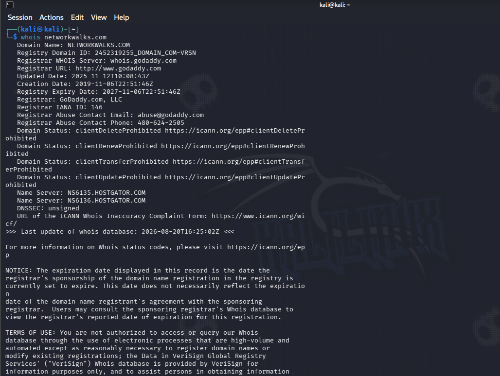
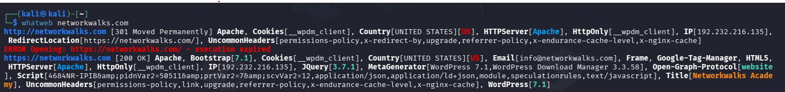
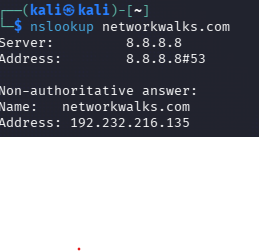
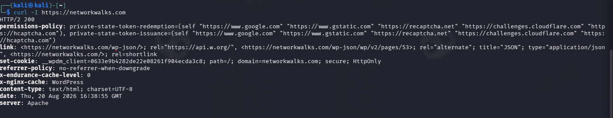
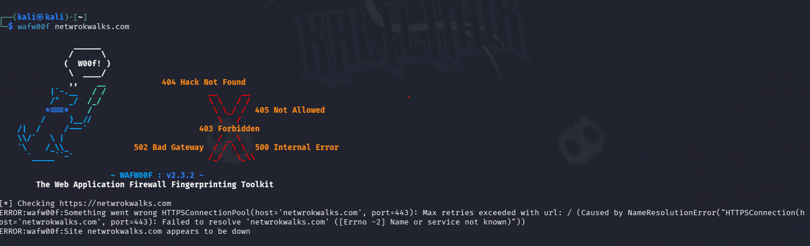
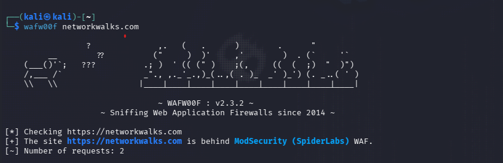
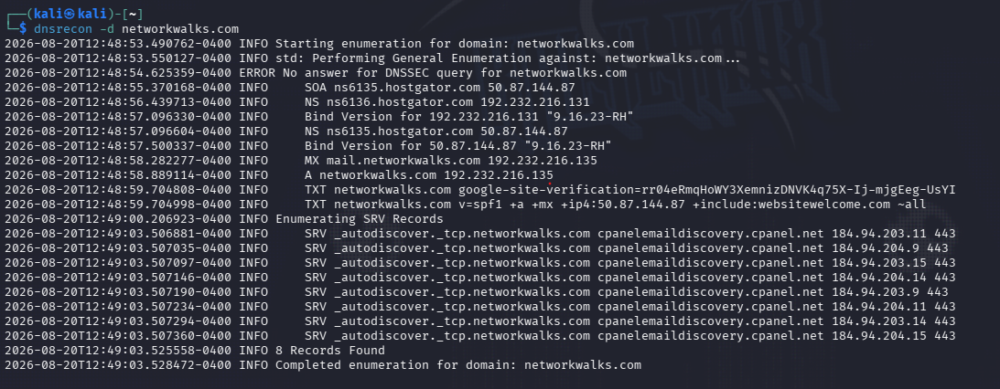
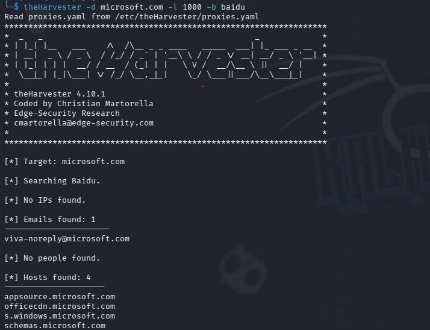
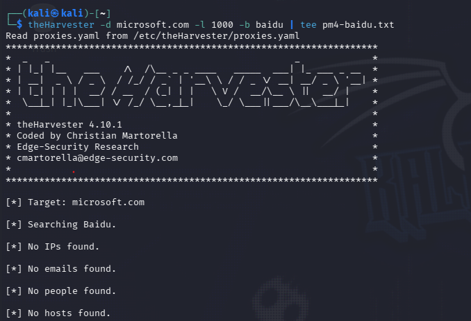
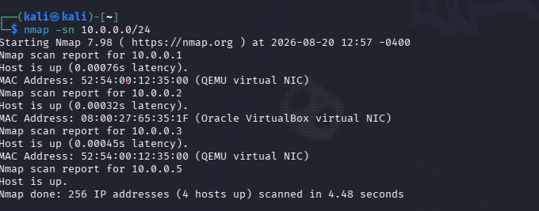

# Week 2: Footprinting, Reconnaissance & Network Scanning

**Student:** Ahmed Adel Goda  
**Batch:** B082 — Networkwalks Cybersecurity & Ethical Hacking Internship  
**Modules:** W2-PM1 + W2-PM4 + W2-PM5 + W2-PM-FINAL  

This documentation covers Week 2 **exactly as I ran it in Kali**, with the same screenshots uploaded in the `evidence/` folder.  
I did **not** copy another student’s repository.

**Scope**
- Footprint `networkwalks.com` (assigned training target with program permission)
- Passive OSINT on `microsoft.com` with theHarvester only (no scanning / no exploitation)
- Ping-scan **my own** VirtualBox NAT Network `10.0.0.0/24`

---

## 1. Lab network used this week (from Week 1)

The same NAT Network from Week 1 was used so Kali could see other lab VMs.

- **Network name:** `NatNetwork`
- **IPv4 prefix:** `10.0.0.0/24`
- **DHCP:** Enabled

Scanning was run **from Kali** (Kali has an address on this network). The Windows laptop is usually on Wi-Fi, so it is **not** the scanner for PM5.

---

## 2. What Week 2 asked for

| Item | Required? | What I did |
|------|-----------|------------|
| At least **one** elective (PM1 / PM2 / PM3 / PM4) | Yes | **PM1** — 6 Kali tools |
| Extra elective | No | **PM4** — theHarvester |
| **PM5** live hosts, IPs, MACs | Yes | `nmap -sn 10.0.0.0/24` (same as Zenmap **Ping Scan**) |
| **Final report** | Yes | Word report in this repo |
| PM2 GHDB / PM3 Maltego | No | Skipped |

Full write-up: [W2-PM-FINAL_Footprinting_Scanning_Report_B082.docx](W2-PM-FINAL_Footprinting_Scanning_Report_B082.docx)

---

## 3. W2-PM1 — Footprinting with multiple Kali tools

Recon (Phase 1) only reads public information. Each tool answers **one** question.

### 3.1 whois — Who registered the domain?

**What it does:** Looks up the public domain database (registrar, dates, nameservers). It does not “hack” the website.

**Command**
```bash
whois networkwalks.com
```

**What I found**
- Registrar: **GoDaddy.com, LLC**
- Created: **2019-11-06** — Registry expiry: **2027-11-06**
- Nameservers: `NS6135.HOSTGATOR.COM` / `NS6136.HOSTGATOR.COM` → hosting **HostGator**

**Problems I hit:** typed `whosis` first; then DNS error until Kali internet worked.



---

### 3.2 whatweb — What software runs the site?

**What it does:** Fingerprints CMS, plugins, server, IP, sometimes an email.

**Command**
```bash
whatweb networkwalks.com
```

**What I found**
- **Apache** + **WordPress 7.1**
- Plugin: **WP Download Manager 3.3.58**
- jQuery 3.7.1, Bootstrap, Google Tag Manager
- IP: **192.232.216.135**
- Email seen: `info@networkwalks.com`



---

### 3.3 nslookup — Domain name → IP

**What it does:** Asks DNS for the IP address of the name.

**Command**
```bash
nslookup networkwalks.com
```

**What I found:** `192.232.216.135` (resolver `8.8.8.8`)



---

### 3.4 curl -I — HTTP headers only

**What it does:** `-I` means headers only (no full page). Shows server type, cookies, extra links.

**Command**
```bash
curl -I https://networkwalks.com
```

**What I found**
- HTTP/2 **200**
- `Server: Apache`
- `x-nginx-cache: WordPress`
- WordPress REST API in `Link:` → `/wp-json/`



---

### 3.5 wafw00f — Is there a WAF?

**What it does:** Detects a Web Application Firewall in front of the site.

**Command**
```bash
wafw00f networkwalks.com
```

**Typo (troubleshooting):** `netwrokwalks.com` failed DNS.



**Correct run:** site is behind **ModSecurity (SpiderLabs)**.



---

### 3.6 dnsrecon — All public DNS records

**What it does:** Lists A / NS / MX / TXT (SPF) / SRV. “No DNSSEC” is normal if DNSSEC is off.

**Command**
```bash
dnsrecon -d networkwalks.com
```

**What I found**
- NS: HostGator — BIND **9.16.23-RH**
- A + MX: **192.232.216.135** (`mail.networkwalks.com`)
- SPF + Google site verification TXT
- SRV autodiscover → **cPanel** email discovery



---

## 4. W2-PM4 — theHarvester (extra elective)

**What it does:** Passive OSINT. Collects **emails and hostnames** from public sources. It does **not** log into Microsoft and I did not scan or phish anyone.

**Assigned target:** `microsoft.com`

### 4.1 Baidu source, limit 1000

```bash
theHarvester -d microsoft.com -l 1000 -b baidu
```

**First run:** 1 email (`viva-noreply@microsoft.com`) and 4 hosts (`appsource`, `officecdn`, `s.windows`, `schemas`).



**Second run:** empty. The lab PDF says results change. Both screenshots are valid.



### 4.2 All sources, limit 50

```bash
theHarvester -d microsoft.com -l 50 -b all
```

**Missing API key** lines (Shodan, Zoomeye, Fofa, …) are **normal** on Kali without paid keys. Free sources still ran.

**Summary:** 3 emails, 126 IPs, 9 ASNs (including AS8075).


---

## 5. W2-PM5 — Network scanning (essential)

**What Zenmap Ping Scan is:** GUI for Nmap. Ping Scan = “who is online?”  
**Same command in Kali:**

```bash
nmap -sn 10.0.0.0/24
```

I did **not** port-scan the internet. Only my lab.

### Lab answers

| Question | Answer |
|----------|--------|
| Subnet | `10.0.0.0/24` |
| How many hosts live? | **4** (including Kali) |
| IPs | `10.0.0.1` `10.0.0.2` `10.0.0.3` `10.0.0.5` |
| MACs | See screenshot (QEMU / VirtualBox). `10.0.0.5` is Kali so Nmap hides its MAC. |

| IP | MAC / note |
|----|------------|
| 10.0.0.1 | `52:54:00:12:35:00` QEMU (gateway) |
| 10.0.0.2 | `08:00:27:65:35:1F` VirtualBox VM |
| 10.0.0.3 | `52:54:00:12:35:00` QEMU |
| 10.0.0.5 | This Kali scanner |



---

## 6. What I learned

- Phase 1 is public information only (WHOIS, DNS, headers, CMS versions).
- A WAF (**ModSecurity**) means naive attacks would be logged/blocked — not tested this week.
- `theHarvester` needs no API keys for a passing lab; empty Baidu is OK.
- Scan **only** networks you own.
- Write down mistakes (typos, VM DNS) — they belong in the report.

---

## 7. Files in this repository

```
README.md
W2-PM-FINAL_Footprinting_Scanning_Report_B082.docx
evidence/
  2.1.png   whois
  2.2.png   whatweb
  2.3.png   nslookup
  2.4.png   curl -I
  2.5.png   wafw00f typo
  2.6.png   dnsrecon
  2.7.png   wafw00f ModSecurity
  2.8.png   nmap -sn lab
  2.9.png   theHarvester Baidu (results)
  3.0.png   theHarvester Baidu (empty)
  3.1-theharvester-all.png
```

**How to add pictures on GitHub:** upload the `evidence/` folder together with this README (paths above must stay `evidence/filename.png`). After upload, GitHub will show the images on this page like Week 1.

---

## Disclaimer

Education only. Authorised internship target + my own lab. No exploitation. Unauthorised access is illegal.
